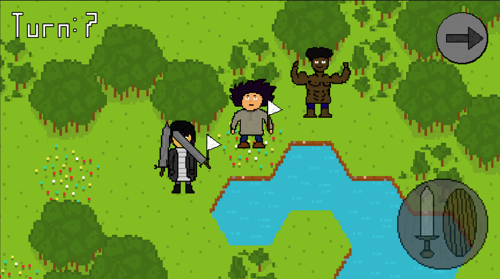
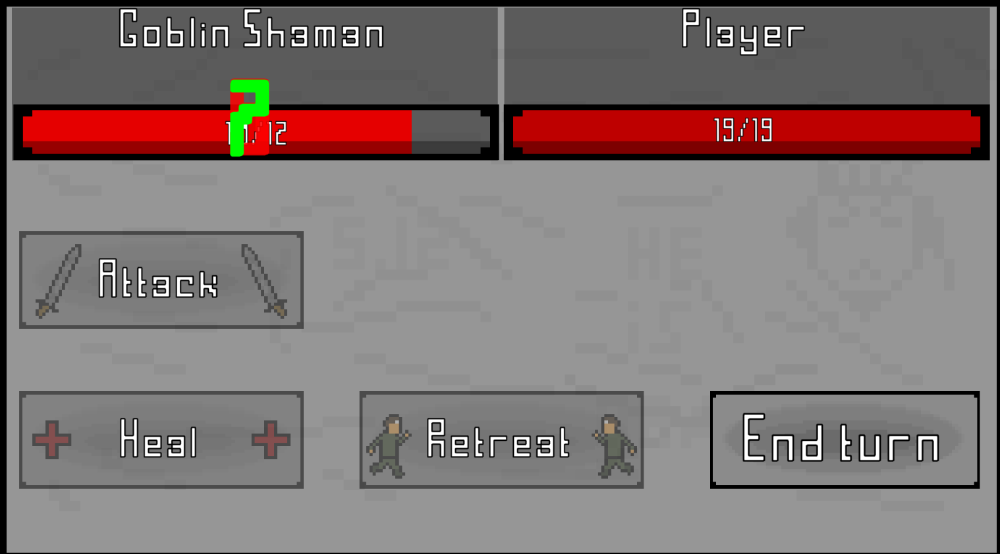
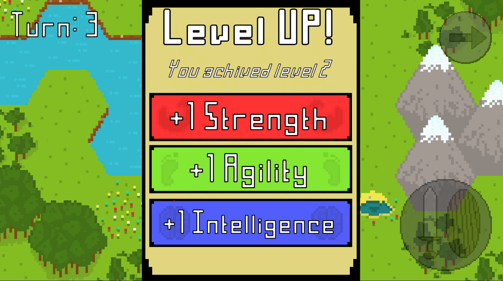
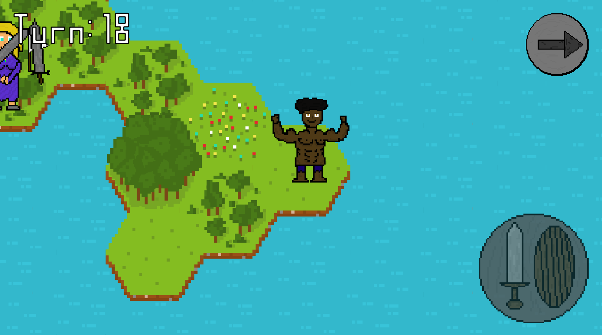
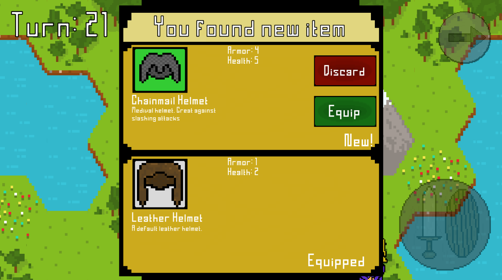
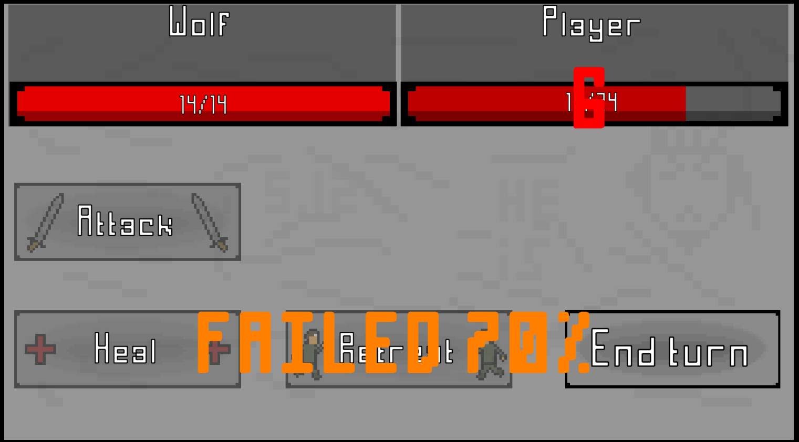
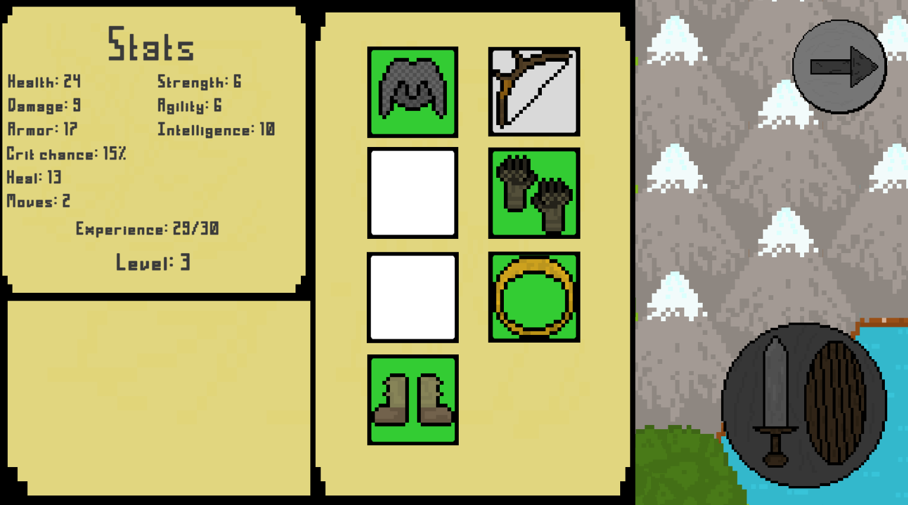

# Friendly RPG


Turn-based RPG game for up to 4 players on one device.

## Description
The game is a turn-based RPG with a lot of different enemies, items, and bosses.
You can play with up to 4 players on one device.
The game has a lot of different mechanics, such as:
- **Movement** - you can move your character on the map.
- **Leveling** - you can level up your character by killing enemies.
- **Stats** - you can increase your stats by leveling up.
- **Items** - you can find items by killing enemies.
- **Equipment** - you can equip items to increase your stats.
- **Healing** - you can heal yourself.
- **Escape** - you can escape from the fight.
- **Bosses** - you can fight with bosses.
- **Win/Lose** - you can win or lose the game.

This project was greatly inspired by the [Pixel Dungeon](https://github.com/watabou/pixel-dungeon) game.

## Screenshots
 
 
 


## Updates

Current version: **v1.1.1**
- **v1.1.1d** - Changed code readability.
- **v1.1.1** - Added missing button click sounds, renamed player prefabs.
- **v1.1.0** - Sound options, player recieve exp for escaping.
- **v1.0.0** - First release.

The game is using [Semantic Versioning](https://semver.org/).

## Contributing
Pull requests are welcome. For major changes, please open an issue first
to discuss what you would like to change.

If you want to make your own versions of the game there are some points that might help.

Make sure you have [Unity](https://unity3d.com/get-unity/download) installed, as the game is made using Unity.

> If you want to add new enemies or items you need to know how to use Unity Editor, rebalancing for example can be done without Unity Editor only by changing values in the scripts.

### Creating new enemies
- Create instance of an `ScriptableObject` `Enemy`.
    > You can create it in any folder you want, but 
    > it is recommended to save each enemy in the apropriate level folder.
- Set all enemy variables
    - `Name`
        > Try to make it not too long.
    - `Level` (recomended max level is 10)
    - `Health`
    - `Damage`
    - `Armor` (then multiplied by a coefficient)
        > You can see coefficients in [Coefficient.cs](./Assets/Scripts/Data/Coefficient.cs) script.
    - `Crit Chance`
    - `Drop Chance` (chance to drop an item)
    - `List of items`
        > You can add items to this list to make this enemy drop them.
        > Please note that each enemy except bosses must have at least one item in this list.
- If enemy is a boss check `is boss` value.
    > Bosses appear only in the end of the game.
- Add enemy object to `Enemies` list in `EnemyList` prefab.
    > If enemy is a boss add it to `Bosses` list in `EnemyList` prefab.

> For example, if you want to add a new level 5 enemy to the game, you need to create a new `ScriptableObject` `Enemy`, set it's `name`, `level` to 5, `health`, `damage`, `armor`, `crit chance`, `drop chance`, and add it to the `Enemies` list in the `EnemyList` prefab.

### Creating new items
- Create instance of an `ScriptableObject` `Item`.
    > You can create it in any folder you want, but
    > it is recommended to save each item in it's type folder and sort in rarity folders.
- Set all variables
    - `Name`
    - `Description`
        > Long description may not fit in the item description window.
    - Create and add item `Icon`
        > Icon should be 24x24 pixels.
        > You can use [this](https://www.piskelapp.com/p/create/sprite) website to create icons.
    - `Type` (Body, Head, Leg, Feet, Hands, Ring, Weapon)
    - `Rarity`
       - 0 - *Common*
       - 1 - *Uncommon*
       - 2 - *Rare*
       - 3 - *Epic*
       - 4 - *Legendary*
       - 5 - *Mythical*
    - Bonus variables.
        > For example, if item is a weapon, you should set `Damage` and `Crit Chance` variables.

> For example, if you want to add a new rare helmet to the game, you need to create a new `ScriptableObject` `Item`, set it's `name`, `description`, set `type` value to head, `rarity` to 2 (rare), add `icon`, and set all bonuses this item gives player.
> Then you need to add this item to the `List of items` in the enemy you want to drop this item.

### Rebalancing
- Go to [Coefficient.cs](./Assets/Scripts/Data/Coefficient.cs) script.
- Change the value you need
    ```
    //armor coefficient
    public static int armor;
    ```
    ```
    //health per strength
    public static int healthPerStrength;
    ```
    ```
    //armor per agility
    public static double armorPerAgility;
    ```
    ```
    //crit chance per intelligence
    public static double critChancePerIntelligence;
    ```
    ```
    //amount of agility per one move
    public static int agilityPerMove;
    ```
    ```
    //damage per level
    public static int damagePerLevel;
    ```
    ```
    //vs enemy escape chance
    public static double enemyLevelEscapeChance;
    public static double enemyStatsEscapeChance;
    ```
    ```
    //vs player escape chance
    public static double playerEnemyStatsEscapeChance;
    public static double playerStatsEscapeChance;
    ```
    ```
    //heal
    public static int intelligencePerHeal;
    public static int healApplication;
    ```
    ```
    //exp per level
    public static int expPerPlayerLevel;
    public static int expPerEnemyLevel;
    ```
    ```
    //exp per enemy level for escape
    public static int escapeExp
    ```
    ```
    //default chance of fight while moving
    public static double defaultFightChance;
    ```

> For example, if you want to increase the amount of health per strength, you need to change the value of `healthPerStrength` variable.

#### Formulas
- Damage reduction
    ```
    //value - amount of damage incoming
    value * (100 - armor * Coefficient.armor)/100
    ```
- Health per strength
    ```
    strength * Coefficient.healthPerStrength
    ```
- Heal amount
    ```
    (intelligence / Coefficient.intelligencePerHeal) * Coefficient.healApplication + level
    ```
- Armor per agility
    ```
    agility * Coefficient.armorPerAgility
    ```
- Crit Chance per intelligence
    ```
    intelligence * Coefficient.critChancePerIntelligence
    ```
- Moves
    ```
    agility / Coefficient.agilityPerMove
    ```
- Damage
    ```
    level * Coefficient.damagePerLevel
    ```
- Escape chance vs enemy
    ```
    //k - player agility or intelligence
    k*Coefficient.enemyStatsEscapeChance - (level - enemy.get_level()) * Coefficient.enemyLevelEscapeChance;
    ```
- Escape chance vs player
    ```
    //k - player agility or intelligence
    k*Coefficient.playerStatsEscapeChance - other_agility* Coefficient.playerEnemyStatsEscapeChance
    ```

## Project status
This project is currently in passive state. Ocasionaly new features and bug fixes will be added.

## License
`Friendly RPG` is free and open-source game licensed under the [MIT](https://choosealicense.com/licenses/mit/).
All images and visuals were created by [Volodymyr Fedyniak](https://www.linkedin.com/in/volodymyr-fedyniak/) and distributed under Creative Commons license ([CC BY-SA 4.0 International](https://creativecommons.org/licenses/by-sa/4.0/)).

